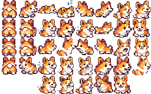

# corgi.js

A cute corgi that follows your mouse cursor around the page.

Based on [oneko.js](https://github.com/adryd325/oneko.js) by adryd.



## Usage

Add a single script tag to your page:

```html
<script src="corgi.js"></script>
```

That's it! A pixel art corgi will appear and chase your cursor.

### Custom sprite

```html
<script src="corgi.js" data-corgi="./my-corgi.png"></script>
```

### Disable position persistence

By default, the corgi's position is saved in `localStorage` so it stays where you left it across page navigations. To disable this:

```html
<script src="corgi.js" data-persist-position="false"></script>
```

## Idle Animations

When the cursor stays still, the corgi will randomly:

- Sit and wait
- Fall asleep (Zzz...)
- Scratch itself
- Wag its tail
- Bark
- Beg with its front paws up
- Scratch the wall (when near screen edges)

## Sprite Sheet

The sprite sheet (`corgi.png`) is a 256x160px image containing 32x32px frames in an 8x5 grid.

Open `sprite-guide.html` in a browser to see the full frame layout and create your own sprites.

## License

MIT License. See [LICENSE](LICENSE).
